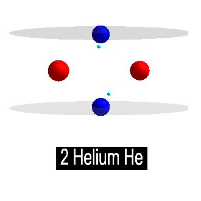
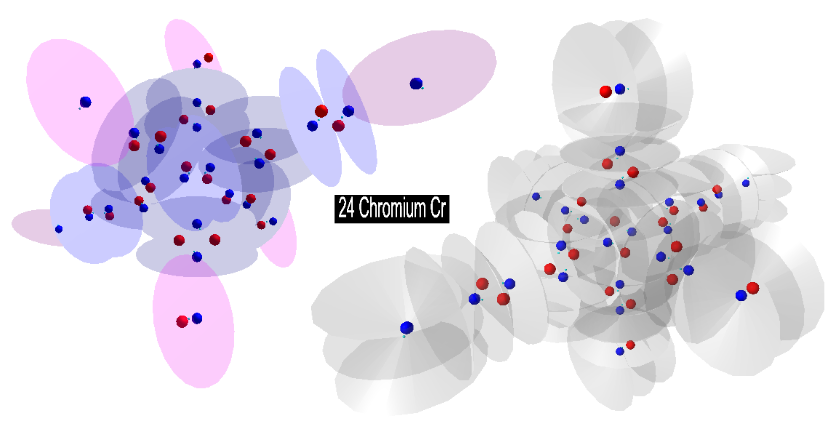

# Charge Field topics on Jupyter Notebook
***
The goal of this project is to introduce Jupyter Notebook users 
to Charge Field physics and the Unified Field theory, etc. 
developed by Miles Mathis. See,
***THE GREATEST STANDING ERRORS IN PHYSICS AND MATHEMATICS***
http://milesmathis.com/index.html

The only true particles in nature are photons, real spinning 
objects with mass and radii as small as 10^(-27)m. Photons travel 
with both forward and angular momentum (c^2) due to both the 
photon's forward and spin tangential light speed velocities, i.e. 
real spinning photons create both electric (linear photon momentum) 
and magnetic (angular photon momentum) fields. All matter larger 
than photons such as electrons, protons, planets, suns or galaxies 
are comprised of and constantly recycle photons, creating the 
charge field. 

# Atom Builder.
***
The Atom Builder (AB) is, I believe, the first such Notebook 
charge field topic. It creates a 3D model of the atomic element 
(1-90) selected by the user. AB is still new and needs plenty of 
work. I imagine it will eventually include a Periodic Table from 
which one might select the desired element. Or not, given the 
atomic output, a new periodic table shape may be in order. For 
the time being, its good enough to share on GitHub. Collaborative 
efforts are welcome.  

Run each cell in turn. Once the control widgets are visible, 
select the desired atom with the drop-down widget, then continue 
running the following cells allowing time for the atom to build. 
Other control options include: type of proton emissions displayed, 
color coding of the specific number of protons in each proton 
stack, proton separation distances, and including an atomic label 
or not. 

After the atom is built, the atom can be spun with up to 19 
different rotation controls which spin each of the atoms' 'slots' 
(this needs to be consolidated). Each slot may contain a neutron 
or a proton, or both, or a single stack of up to 6 protons, 6 
neutrons and 6 electrons. Each atom has up to 19 occupied slots
and only a few of the larger atoms have all 19 slots occupied. 
Each object within each slot spins about the slot center at the 
same rate, which is not correct, yet it provides a good idea how 
the atom spins. Eventually, all protons, neutrons and electrons 
should spin at their own rates.

The first rotation control, grpAn, spins the 'Carousel', which 
includes the front/back and left/right objects (neutrons or 
protons) connected to the center slot but not in the up/down 
directions on the atom's main vertical column. The output 
displays the up/down atomic dimension sideways to save space, 
the orbital camera allows views from most angles. The rest of 
the rotation controls spin each of the slots. If a slot is 
unoccupied, the corresponding slot rotation control has 
nothing to spin and will not work erroring just that control. 
  
The reference's ***SECTION 9: THE NUCLEUS*** contains 
descriptions and diagrams of charge channeling and charge 
recycling by the elements. See,
***How to Build the Elements***. 
>Explaining the periodic table, with nuclear diagrams". 
http://milesmathis.com/nuclear.pdfhttp://milesmathis.com/nuclear.pdf

#### Files
***
AtomBuilder.ipynb was created using Jupyter Notebook 6.4.0. 
The code needs to import: pythreejs for the graphics, IPython 
for the display and ipywidget for the controls. 

As I understand it. The .ipynb_checkpoints folder/directory 
amounts to a temporary backup file generated by notebook user's 
manual save commands; allowing the user to revert to the 
previous saved command. It's not needed, I tried including it in 
the gitignore file but its still in the repository. 

This README file was also written with Jupyter notebook.

#### For discussion, visit "Miles Mathis' Charge Field - Portal" 
***
at https://milesmathis.forumotion.com/ 
This particular project is described in the 
***Miles Periodic Table with Standard Periodic Table reference*** 
thread,
https://milesmathis.forumotion.com/t634p75-miles-periodic-table-with-standard-periodic-table-reference#6702

#### Contributing
***
Miles Mathis' Charge Field ideas are free. This project is 
intended to be a Public Domain free and open source, Jupyter 
Notebook application example
https://jupyter.org/
developed from graphics examples found at pythreejs  
https://pythreejs.readthedocs.io/en/stable/examples/index.html
and widgets found at
https://ipywidgets.readthedocs.io/en/latest/examples/Widget%20Basics.html
following Miles Mathis' ideas.
http://milesmathis.com/index.html

This was Cr6's idea. Pardon my interpretations. I'm trying 
to learn. Plenty of mistakes to call my own.

Pull requests are welcome. For major changes, please open an 
issue first to discuss what you'd like to change.
